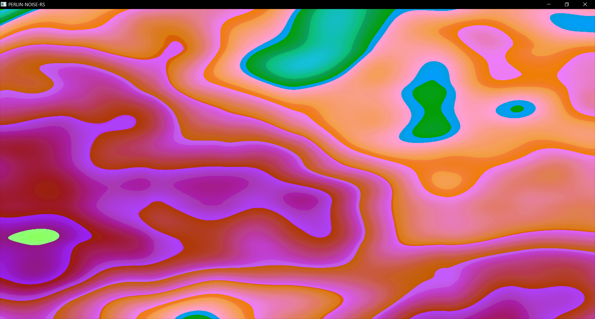

# perlin-noise-rs

Originally I was supposed to write the algo for perlin noise but I decided that
I didn't wanna and instead I just wanted to see pretty pictures on the screen.
This was suffering.

